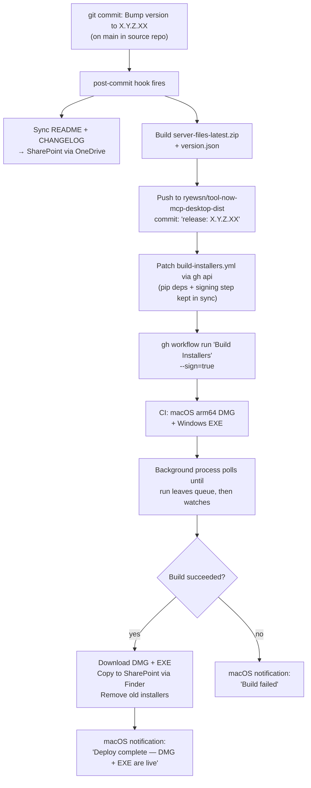

# tool-now-mcp-desktop-dist

Distribution and CI repo for the [ServiceNow MCP for Claude Desktop](https://github.com/Now-AI-Foundry/tool-now-mcp-desktop) installer pipeline.

## Why this repo exists

This repo is public and separate from the main source repo for two reasons, both required:

**Update check and update delivery.** The MCP server fetches `version.json` from this repo on startup to check for new versions, and the background update process downloads `server-files-latest.zip` from here to apply them. End-user clients have no GitHub authentication, so these files must be publicly accessible. The main source repo (`Now-AI-Foundry/tool-now-mcp-desktop`) is private and cannot serve this purpose.

**CI quota.** The `Now-AI-Foundry` org does not have GitHub Actions minutes for macOS and Windows builds. This repo runs CI under the `ryewsn` personal account which has the necessary quota. No source code is stored here — the actual sources are checked out at build time via `MAIN_REPO_PAT`.

## Files

| File | Purpose |
|------|---------|
| `version.json` | Current version string; fetched by the MCP server update check at runtime |
| `server-files-latest.zip` | Bundled Python sources; downloaded by the background update process to apply updates |
| `.github/workflows/build-installers.yml` | Builds macOS arm64 DMG + Windows EXE on `workflow_dispatch` |

## How the pipeline works



Pipeline log: `tail -f ~/.snmcp-deploy.log`

## Secrets

| Secret | Required for | Purpose |
|--------|-------------|---------|
| `MAIN_REPO_PAT` | All builds | Read access to `Now-AI-Foundry/tool-now-mcp-desktop` for workflow checkout |
| `APPLE_CERT_P12` | Signing only | Apple Developer ID certificate (base64-encoded) |
| `APPLE_CERT_PASSWORD` | Signing only | Certificate password |
| `APPLE_API_KEY` | Notarization only | App Store Connect API key (base64-encoded) |
| `APPLE_API_ISSUER_ID` | Notarization only | App Store Connect issuer ID |

## Triggering a build manually

```bash
# Unsigned (for testing)
gh workflow run "Build Installers" --repo ryewsn/tool-now-mcp-desktop-dist

# Signed + notarized (for distribution)
gh workflow run "Build Installers" --repo ryewsn/tool-now-mcp-desktop-dist -f sign=true
```

Artifacts are uploaded with 3-day retention. The background deploy process in the post-commit hook downloads them automatically and copies them to SharePoint.
